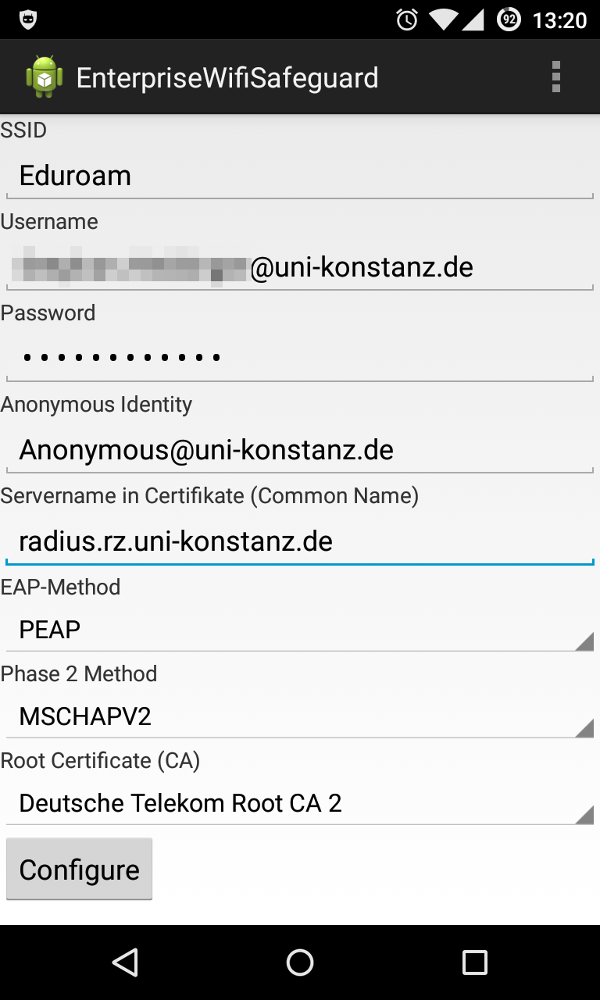

# EnterpriseWifiSafeguard

## Introduction
EnterpriseWifiSafeguard is an Android App for setting up Wifis with WPA/WPA2-Enterprise. It provides a lot of built in certificates and it is possible to set the
subject_match option from the WPA_Supplicant for security reasons. 

## Build Requirements

## Build Instructions

## Setup Instructions

The settings heavily depend on what your Wifi provider requires. For the University of Konstanz the following screenshot will be helpfull:

